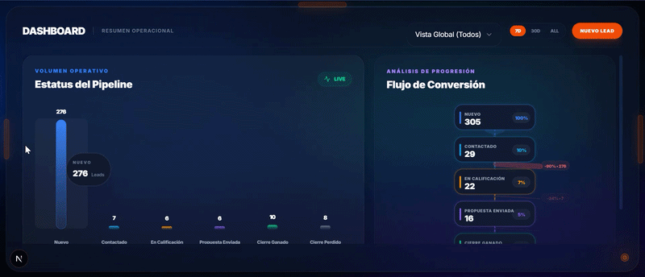
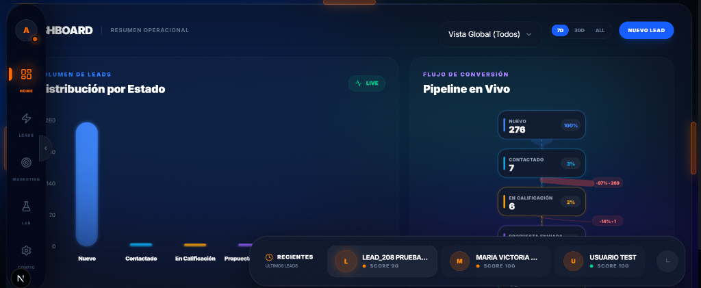
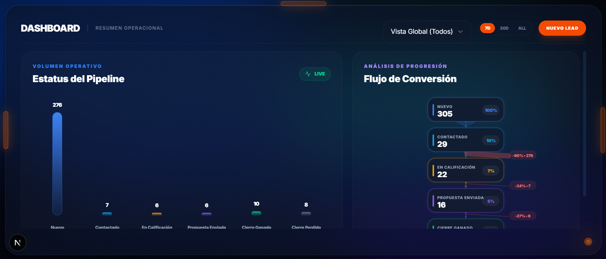
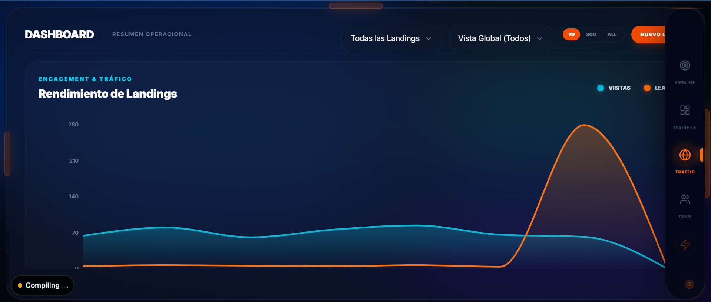
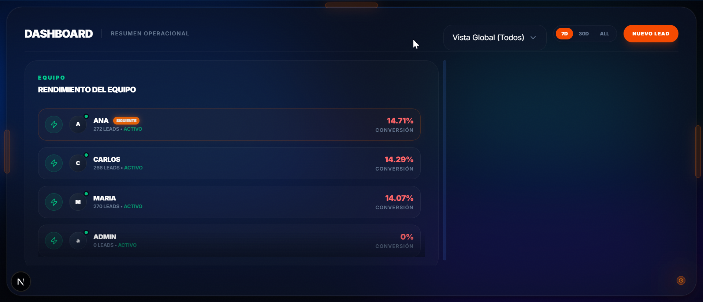
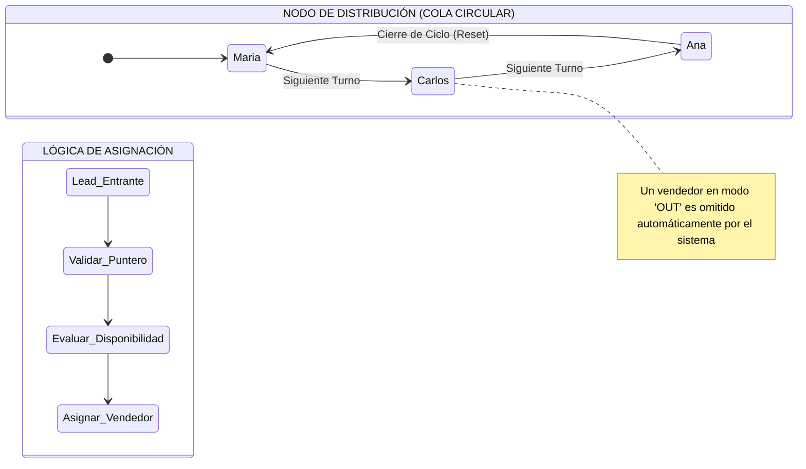
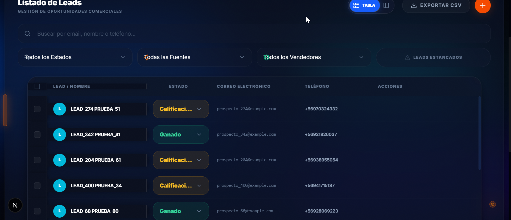
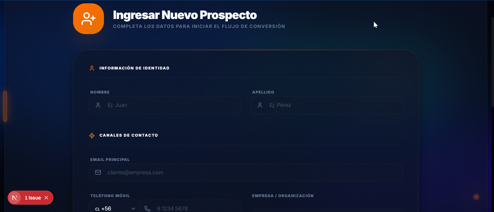
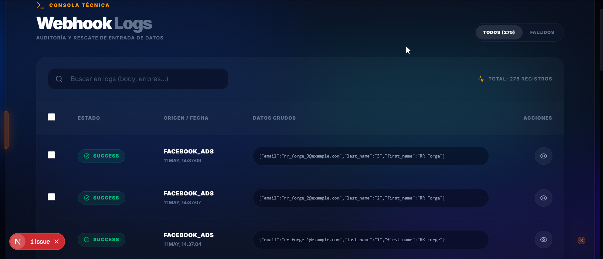
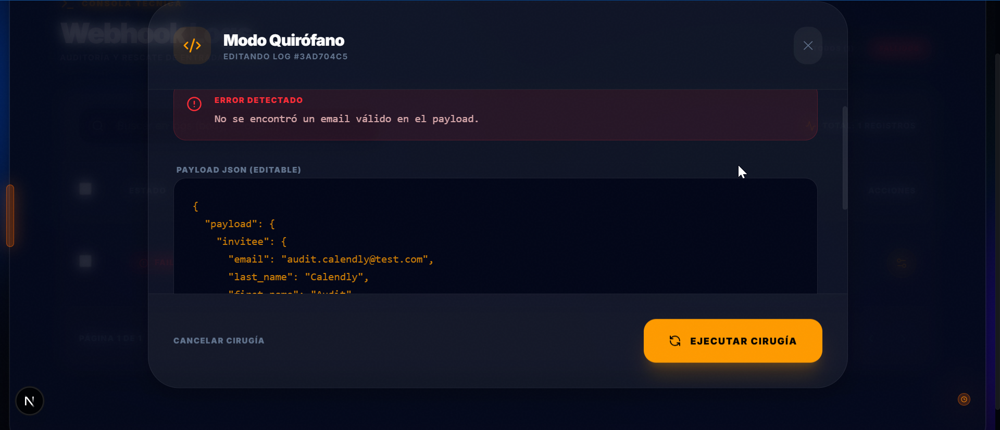

# Lead Flow



**Lead Flow** es una plataforma diseñada para la gestión de inversiones inmobiliarias a gran escala. Es una suite completa de ingeniería de datos que centraliza la captura, resolución de identidad y distribución de prospectos comerciales desde múltiples canales digitales.

---

## 🏛️ Arquitectura del Sistema

El sistema sigue una arquitectura de servicios desacoplados diseñada para la resiliencia y el alto rendimiento:

### 1. Backend (Django REST Framework)
- **Engine**: Python 3.11 + Django 4.2.
- **Base de Datos**: PostgreSQL 15, optimizado con bloqueos transaccionales (`FOR UPDATE`).
- **Procesamiento Asíncrono**: Django Q. Las tareas pesadas (ingesta de webhooks, generación de PDFs, envío de correos) no bloquean el flujo principal.
- **Auditoría**: `django-simple-history` para trazabilidad total de cambios en los modelos `Lead` y `Property`.

### 2. Frontend (Next.js 14 Performance Edition)
- **App Router**: Renderizado híbrido (SSR/CSR) para máxima velocidad.
- **Virtualized Grid**: Uso de `@tanstack/react-virtual` para renderizar miles de leads con un consumo de memoria mínimo (60 FPS scroll).
- **Kanban Engine**: Gestión visual del pipeline comercial con estados dinámicos.
- **Data Hydration**: SWR para sincronización de datos en tiempo real sin recargas de página.

### 3. Resilience Node (Lead Forge Pro)
- **Audit Tool**: Una aplicación independiente en **Streamlit** que actúa como "Chaos Monkey" y generador de carga para certificar la estabilidad del backend ante picos de tráfico.

---

## 🧬 Soluciones a Problemas Complejos

### 1. El Dilema de la Identidad (Double Anchor System)
**Problema**: Un cliente entra por Facebook. Luego el vendedor cambia su correo a uno "corporativo". Mañana el cliente vuelve a entrar por una landing usando su correo personal. ¿Cómo evitar el duplicado?
**Solución**: Implementamos un sistema de **Doble Ancla**. 
- `original_email`: Capturado en el primer contacto, es **inmutable**. Se usa como clave primaria lógica de identidad.
- `contact_email`: Editable para fines comerciales.
El sistema busca coincidencias en AMBOS campos antes de decidir si crea un nuevo lead o actualiza uno existente.

### 2. Webhook Racing (Race Conditions)
**Problema**: Dos servicios externos mandan datos del mismo lead al mismo milisegundo. Dos procesos de Django intentan crear el lead simultáneamente, resultando en duplicados o errores de integridad.
**Solución**: 
- **Row-Level Locking**: Usamos `select_for_update()` dentro de un `transaction.atomic()`. El primer proceso que llega bloquea la búsqueda del lead; el segundo debe esperar a que el primero termine.
- **Integrity Fallback**: Si el bloqueo falla por milisegundos, el constraint `UNIQUE` de PostgreSQL dispara un error que capturamos para redirigir el flujo a una actualización limpia.

### 3. Ingesta Tolerante a Fallos (Modo Quirófano)
**Problema**: Un servicio externo cambia su formato JSON sin avisar y los webhooks empiezan a fallar.
**Solución**: Cada petición se guarda en un `WebhookLog` en estado `PENDING`. Si el procesador falla, el log queda como `FAILED`. Un administrador puede entrar al dashboard, **editar el JSON crudo directamente** y ejecutar el botón "Reprocess" para recuperar el lead sin que el cliente sepa que hubo un error técnico.

---

## 🚀 Funcionalidades Elite

### 📧 Automatización y Scoring
- **Dynamic Scoring**: Cada lead recibe un puntaje (0-100) basado en la completitud de su perfil (Teléfono: 40pts, Email: 30pts, etc.).
- **Nurturing Automático**: Si un lead es "Hot" (Score > 70), el sistema dispara inmediatamente una tarea asíncrona para enviar un **Welcome Email** personalizado.
- **Alertas Proactivas**: El sistema detecta leads "Estancados" (sin cambios en 24h) y lanza alertas visuales en el dashboard.

### 📄 Generación de Catálogos (Brochure Engine)
- **PDF Dinámico**: El sistema toma los datos del lead, la campaña y las propiedades vinculadas para generar un **Brochure PDF de alta calidad** usando `xhtml2pdf`.
- **Mapas Estáticos**: Integración con Mapbox API para inyectar mapas de ubicación exactos en los documentos PDF generados.

### 🔄 Distribución Equitativa (Round Robin)
- El sistema mantiene un estado global (`RoundRobinState`) para asegurar que cada nuevo lead se asigne secuencialmente al siguiente vendedor disponible, evitando favoritismos y asegurando una respuesta rápida.

---

## 🎮 Módulos y Experiencia de Usuario

### 🔐 Autenticación y Seguridad (Acceso al Nodo)

El acceso al sistema está blindado mediante una interfaz de **"Terminal de Nodo"**, diseñada para proyectar seguridad y control desde el primer contacto.



*   **Autenticación JWT:** Implementa un sistema de tokens asíncronos (JSON Web Tokens) para una comunicación *stateless* y segura.
*   **Control de Acceso Basado en Roles (RBAC):** El sistema identifica automáticamente si el usuario es un **Administrador de Nodo** o un **Agente de Ventas**, redirigiendo dinámicamente al dashboard correspondiente.

#### 🔑 Credenciales de Acceso (Entorno de Desarrollo)
Para fines de evaluación y pruebas en el entorno local, se han pre-configurado las siguientes llaves de acceso:

*   **Administrador Maestro:** 
    *   **Terminal ID:** `admin`
    *   **Security Key:** `123`
*   **Agentes de Ventas:** El sistema cuenta con perfiles de vendedores (`maria`, `carlos`, `ana` con clave `123`), aunque sus vistas específicas están en proceso de desarrollo.

---

### 🖥️ Dashboard Estratégico: El Poder de la Vista Única

El dashboard principal ha sido diseñado bajo una filosofía de **Control Situacional**, eliminando la fricción de la navegación tradicional para convertir los datos en decisiones instantáneas.



#### 🎴 Navegación Inmersiva y Paneles de Control
El sistema utiliza una arquitectura de paneles deslizables (*Drawers*) diseñados para mantener el enfoque operativo mientras se accede a capas profundas de datos:

*   **Sidebar (Navegación Primaria - Eje Central):** Una pieza de ingeniería visual diseñada bajo el concepto de **"Macro-Módulos"**. No es una barra estática, sino una interfaz dinámica que se oculta y revela mediante un área de disparo (*trigger*) sensible al movimiento.
    *   **Estructura y Estética:** Implementa un diseño *Glassmorphism Pro* con fondo ultra-oscuro y desenfoque *backdrop-blur-3xl*. Cuenta con una jerarquía vertical clara: Perfil de Usuario en la cima, Macro-Grupos operativos al centro y branding de marca en la base.
    *   **Navegación por Macro-Grupos:**
        *   **Módulo Gestión (`leads`):** Centraliza el Dashboard, el Listado Maestro de leads y el acceso al Formulario de Alta (Formik+Yup).
        *   **Módulo Marketing (`marketing`):** (Admin Only) Orquesta Landing Pages dinámicas, Campañas de Brochures PDF y el Catálogo de Propiedades.
        *   **Módulo Laboratorio (`lab`):** (Admin Only) Espacio técnico para analíticas de rendimiento, Email Sandbox y Webhook Logs (Modo Quirófano).
        *   **Módulo Ajustes (`config`):** (Admin Only) Control total sobre Usuarios y Roles (RBAC).
    *   **Funcionalidades Inteligentes:** Incluye *Active Indicators* visuales para ubicación espacial, flyouts de perfil para gestión de sesión y *Data Prefetching* automático al hacer hover sobre los módulos para una carga instantánea.
*   **Right Sidebar (Panel de Contexto Operativo):** Un panel de alta densidad informativa diseñado para la supervisión en tiempo real. **Nota:** Este panel es exclusivo de la vista de Dashboard Principal para optimizar el foco operativo.
    *   **Performance Node (Motor de Reparto):** Ubicado en la parte superior del panel, permite la gestión instantánea de la disponibilidad del equipo. Es aquí donde se orquesta el **Round Robin**, permitiendo activar/desactivar vendedores y visualizar quién es el "Siguiente en Línea" para recibir leads.
    *   **Feed de Actividad (Pulso del Negocio):** Una línea de tiempo dinámica que registra cada interacción crítica (captura de webhooks, cambios de estado, notas de vendedores). Proporciona feedback visual inmediato sobre el estado de la operación sin necesidad de navegar a módulos profundos.
    *   **Estética de Enfoque:** Implementa una transición de deslizamiento lateral que se integra con el diseño *Glassmorphism* general, manteniendo el contexto del negocio siempre a un vistazo de distancia.
*   **Top Drawer (Métricas de Tráfico - Análisis Elevado):** Invocado desde la parte superior, este panel despliega el análisis técnico del pulso digital. Permite auditar el rendimiento de cada landing page y visualizar picos de tráfico sin necesidad de abandonar la lista de trabajo actual, ideal para supervisiones rápidas.
*   **Dashboard Dock (Historial Rápido - Memoria de Trabajo):** Situado en la esquina inferior derecha, funciona como una "memoria de acceso rápido". Registra automáticamente los últimos leads visitados, permitiendo saltar de vuelta a una negociación previa con un solo clic, eliminando la necesidad de re-busquedas constantes.



---

### 🔄 Reparto Inteligente (Round Robin Pro)

El sistema de distribución de leads es el corazón operativo de **Lead Flow**. Utiliza un algoritmo de **Round Robin Determinista** que garantiza un reparto equitativo y transparente entre el equipo de ventas.



#### Mecanismo de Funcionamiento:



1.  **Algoritmo de Rotación:** El sistema mantiene un puntero global (`RoundRobinState`) que apunta al último vendedor que recibió un lead. El siguiente prospecto se asigna automáticamente al siguiente vendedor en la lista circular.
2.  **Gestión de Disponibilidad en Tiempo Real:** 
    *   Los administradores pueden activar o desactivar vendedores del flujo de reparto con un solo clic (botón de "Rayito").
    *   Si un vendedor está en modo **"OUT"** (Pausado), el sistema lo salta automáticamente y busca al siguiente disponible, asegurando que ningún lead quede sin atención.
3.  **Visibilidad Total (Next in Line):**
    *   **Badge "SIGUIENTE":** Identifica visualmente al vendedor que recibirá el próximo lead entrante, permitiendo al equipo prepararse para la acción.
    *   **Badge "OUT":** Indica claramente quién está fuera de la rotación actual, permitiendo una gestión de turnos eficiente.
4.  **Sincronización de Datos:** Cada cambio en la disponibilidad del equipo se refleja instantáneamente en el dashboard mediante un sistema de hidratación de datos optimizado, garantizando que el "Siguiente en línea" sea siempre preciso.

---

### 🚀 Módulo de Leads: Centro de Gestión Comercial

Este módulo es la herramienta principal de trabajo diario. Está diseñada para centralizar todos los prospectos y permitir una gestión rápida y eficiente del ciclo de vida de cada venta.



#### 🏗️ Estructura y Funcionamiento:
*   **Filtros y Segmentación:** Permite buscar por texto y filtrar por estado, fuente de origen (landing pages) y vendedor asignado. Incluye un acceso rápido para leads "estancados" (sin actividad en las últimas 24 horas).
*   **Listado Virtualizado:** Utiliza `@tanstack/react-virtual` para gestionar cientos de registros sin perder rendimiento, asegurando un desplazamiento suave y una carga inmediata.
*   **Visualización Dual:** El usuario puede alternar entre una tabla detallada para gestión masiva y una vista Kanban para el seguimiento visual del flujo de ventas.
*   **Edición Rápida:** Los estados y asignaciones se pueden modificar directamente desde la lista, lo que agiliza la actualización del pipeline sin necesidad de navegar a otras pantallas.
*   **Acciones por Lote:** Permite seleccionar múltiples registros para reasignar vendedores o cambiar estados de forma masiva.

#### 🛠️ Tecnología Utilizada:
*   **Frontend:** React y Next.js con una arquitectura de hooks personalizados para separar la lógica de los componentes.
*   **Sincronización:** Uso de **SWR** para mantener los datos actualizados en tiempo real y **useSearchParams** para que los filtros se reflejen en la URL.
*   **Diseño:** Interfaz oscura basada en **Tailwind CSS**, enfocada en la claridad de los indicadores de estado y la densidad de información.

---

### ➕ Nuevo Lead: Creación y Validación Inteligente

El sistema permite la captura manual de prospectos a través de una interfaz optimizada que garantiza la integridad de los datos desde el primer segundo.



#### Tecnología y Funcionamiento (Deep Dive):
*   **Arquitectura de Formulario (Formik + Yup):** Utilizamos **Formik** para la gestión de estados complejos y **Yup** para la validación declarativa de esquemas. Esto garantiza que ningún dato mal formado llegue al servidor.
*   **Persistencia de Borradores:** Implementa `FormikPersist` para guardar el estado del formulario en `localStorage`. Si el usuario navega fuera o refresca la página, los datos ingresados no se pierden.
*   **Validación de Identidad (Double Anchor):** Al intentar crear un lead, el sistema ejecuta una búsqueda cruzada instantánea en la base de datos para detectar si el prospecto ya existe (por `original_email` o teléfono), evitando la creación de registros duplicados.
*   **Normalización de Datos:** El frontend procesa automáticamente los códigos de país y limpia los formatos telefónicos antes de la inyección en la base de datos.
*   **Disparo de Reparto Automático:** Una vez validado, el lead es procesado por el motor de **Round Robin** e inyectado inmediatamente en el flujo de trabajo del vendedor asignado.

---

### 📊 Auditoría de Tráfico (Webhook Logs)

Para mantener un control total sobre el flujo de datos, **Lead Flow** implementa una consola de auditoría técnica que registra cada interacción desde fuentes externas.



#### Funcionamiento de la Consola:
*   **Monitoreo en Tiempo Real:** Lista cronológica de todas las peticiones entrantes (Facebook, Google Ads, Landing Pages).
*   **Filtrado por Estado:** Permite identificar rápidamente peticiones `PENDING`, `SUCCESS` o `FAILED` para detectar anomalías en la comunicación.
*   **Trazabilidad de Errores:** En caso de fallo, la consola expone el error técnico exacto reportado por el servidor, facilitando el diagnóstico sin necesidad de revisar logs de servidor pesados.

---

### 🏗️ Arquitectura de Resiliencia (Bajo el Capó)

La robustez de **Lead Flow** no es accidental; es el resultado de una arquitectura diseñada para soportar alta concurrencia y picos de tráfico masivos.

#### 1. Ingesta Atómica de Webhooks
Cuando un bit toca el servidor, se activa un protocolo de tres capas:
*   **Aislamiento (Isolation):** El webhook se guarda inmediatamente como un `WebhookLog` crudo. El sistema responde `200 OK` en <50ms para evitar timeouts del proveedor externo (Meta, Google).
*   **Procesamiento Asíncrono:** La lógica pesada se delega a **Django Q (Workers)**, permitiendo que el backend siga recibiendo datos mientras los procesos previos se ejecutan en segundo plano.
*   **Bloqueo de Base de Datos (Select For Update):** Para evitar que dos webhooks del mismo lead al mismo milisegundo creen duplicados, el sistema usa bloqueos de fila (`FOR UPDATE`) en PostgreSQL. El primer proceso "atrapa" al lead y los demás deben esperar en cola.

#### 2. Resolución de Identidad (Double Anchor System)
El motor de búsqueda utiliza un sistema de **Doble Ancla** para resolver el problema de la mutación de datos de contacto, garantizando que un prospecto sea reconocido incluso años después de su primer contacto.

*   **Ancla Inmutable (`original_email`):** Se captura en la primera interacción y es de solo lectura. Funciona como la "huella genética" del lead y es la clave primaria lógica para la unificación (**Búsqueda hacia el pasado**).
*   **Ancla Fluida (`contact_email`):** Es el correo que el vendedor edita para la gestión comercial activa. Permite que el sistema reconozca al lead si este re-ingresa usando una identidad que el vendedor ya "mapeó" manualmente (**Búsqueda en el presente**).

**Sinergia de la lógica `Q(OR)`:**
1.  **Reconocimiento por Origen:** Si el lead vuelve a usar su correo de hace 3 años (aunque el vendedor lo haya cambiado en la ficha), el sistema lo encuentra por su "huella genética" (`original_email`).
2.  **Reconocimiento por Evolución:** Si el lead entra con un nuevo correo corporativo que el vendedor registró ayer en la ficha de contacto, el sistema lo identifica inmediatamente por su "identidad evolucionada" (`contact_email`).

En ambos escenarios, el sistema evita el duplicado y anexa la nueva interacción al historial existente, manteniendo la integridad del **Customer Journey** completo.

#### 3. Motor Round Robin Determinista
La asignación no es aleatoria. El sistema consulta el `RoundRobinState` bloqueando el registro de estado para garantizar que el puntero de asignación sea único y equitativo, incluso si entran 100 leads simultáneamente.

---

### 🩺 Recuperación Crítica (Modo Quirófano)

El **Modo Quirófano** es la herramienta de última instancia para garantizar que ningún lead se pierda por problemas de formato o cambios inesperados en las APIs externas.



#### La Solución a Problemas Técnicos:
1.  **Intervención Directa:** Cuando un lead falla por datos mal formados, el administrador puede abrir el registro y acceder al JSON crudo.
2.  **Edición Quirúrgica:** Permite modificar el contenido del mensaje recibido directamente en la interfaz para corregir campos faltantes o errores de sintaxis.
3.  **Reprocesamiento Forzado:** Al guardar los cambios, el sistema permite re-ejecutar la lógica de creación de leads sobre el dato corregido, recuperando la oportunidad comercial de forma instantánea.

---

### 🛡️ Lead Forge: Probador de Webhooks

Esta herramienta sirve para verificar que el sistema recibe y procesa correctamente los leads que llegan desde servicios externos.

#### ¿Qué hace esta herramienta?
Simula el envío de datos reales desde plataformas como Calendly o Mailchimp hacia el CRM. Es útil para:
*   **Probar la recepción:** Confirmar que los datos entran correctamente al sistema y se guardan en la base de datos.
*   **Validar la identidad:** Verificar que el sistema no duplique a una persona si llega desde distintas fuentes (ej. primero por Mailchimp y luego por Calendly).
*   **Pruebas de carga:** Ver cómo reacciona el servidor y la base de datos si entran muchos leads al mismo tiempo.

#### ⚙️ ¿Cómo funciona la recepción (`api/v1/webhooks/receive/`)?
Cuando un servicio externo envía datos a esta dirección del servidor, el CRM realiza los siguientes pasos:
1.  **Identificación:** Revisa el origen del dato para saber qué formato tiene (Mailchimp, Calendly, etc.).
2.  **Traducción:** Convierte los datos externos al formato que entiende el CRM.
3.  **Búsqueda (Doble Ancla):** Busca en la base de datos si el lead ya existe comparando tanto el correo original como el de contacto actual.
4.  **Acción:** Si el lead es nuevo, lo crea y lo asigna a un vendedor por Round Robin. Si ya existe, actualiza su ficha y registra la nueva actividad.
5.  **Log de Auditoría:** Guarda el mensaje original (JSON) en un historial de webhooks. Si algo falla, un administrador puede editarlo y volver a procesarlo.

#### Cómo usarlo:
```bash
cd tools/lead-generator
streamlit run lead_forge.py
```

---

### 🚀 Módulos Avanzados (En Desarrollo y Auditoría)

#### 📧 Motor de Correos y Automatización
El sistema cuenta con un motor de mensajería asíncrono diseñado para el "Nurturing" de prospectos y alertas operativas:
*   **Servidor de Correo Interno (`DatabaseEmailBackend`):** Para garantizar la trazabilidad y seguridad, el CRM intercepta todos los envíos y los persiste en la base de datos. Esto permite auditar qué recibió cada cliente y ofrece un entorno de "Sandbox" seguro.
*   **Automatización Asíncrona (Django Q):** El envío de correos no bloquea la interfaz. Tareas en segundo plano gestionan:
    *   **Welcome Emails:** Envío inmediato al prospecto con enlaces a su información personalizada.
    *   **Vendor Alerts:** Notificaciones críticas a los vendedores cuando reciben un nuevo lead.
*   **Timeline Inteligente:** Cada correo enviado genera automáticamente una **Interacción** en la línea de tiempo del lead, permitiendo un seguimiento 360°.

#### 📄 Generador de Brochures PDF (Dynamic Engine)
Capacidad de generar folletos inmobiliarios personalizados al vuelo basándose en el perfil del lead y la campaña:
*   **Tematización Dinámica:** El PDF adopta automáticamente la paleta de colores de la Landing Page original del lead para mantener la coherencia visual.
*   **Integración con Mapbox:** Inyecta mapas estáticos de ubicación con pines georreferenciados para cada propiedad incluida en el folleto.
*   **Ficha Técnica Automatizada:** Extrae fotos, precios y características (amenities) directamente del catálogo de activos.

#### 🏠 Catálogo de Activos Inmobiliarios (Inventory Hub)
Este módulo permite transformar proyectos de construcción en activos digitales comercializables:
*   **Geolocalización con Mapbox:** Autocompletado de direcciones y captura automática de coordenadas para el motor de mapas.
*   **Gestión de Atributos:** Sistema de etiquetas dinámicas (JSON) para amenities y características financieras (ROI, inversión mínima).
*   **Media Asset Library:** Biblioteca centralizada para garantizar la calidad visual en landing pages y brochures.

---

### 📂 Ecosistema de Marketing e Inventario

El sistema organiza la captación y el inventario de forma circular para asegurar que cada lead reciba la información exacta que busca:

#### 🎯 Campañas: El Eje Central
La **Campaña** es la entidad que define la estrategia. Centraliza el presupuesto y, lo más importante, el **catálogo de activos** que se quiere promocionar. 
*   **Contenido Dinámico:** La campaña define los textos y beneficios que se inyectarán en los Brochures PDF.
*   **Relación con Inventario:** Una campaña puede agrupar múltiples propiedades (ej: "Especial Inversión 2024").

#### 🌐 Landing Pages: Puntos de Captura
Cada campaña puede tener múltiples **Landing Pages** activas simultáneamente. Esto permite realizar pruebas A/B o segmentar por canal:
*   **Personalización Visual:** Cada landing define su propio color primario, imágenes y estructura de beneficios.
*   **Vínculo Técnico:** Al estar asociada a una campaña, cualquier lead que entre por la landing recibirá automáticamente el catálogo de propiedades de dicha campaña.

#### 🏠 Propiedades: El Catálogo Maestro
Es el inventario físico del CRM. Cada propiedad es un activo digital completo con:
*   **Datos Financieros:** ROI estimado, inversión mínima y fechas de entrega.
*   **Geolocalización:** Coordenadas exactas que el motor de PDF usa para generar mapas de ubicación automáticos.
*   **Vínculo con Campañas:** Una misma propiedad puede participar en diferentes campañas de marketing de forma independiente.

#### 🔄 El Flujo de Datos
1.  **Captura:** El usuario llega a una **Landing Page** y deja sus datos.
2.  **Vinculación:** El sistema crea el **Lead** y le asigna la **Campaña** y la **Fuente** de esa landing.
3.  **Entrega:** El motor de automatización detecta la campaña, extrae las **Propiedades** vinculadas a ella y genera el PDF personalizado que se le envía al lead por correo.

---

## 🛠️ Guía de Instalación y Despliegue

### Requisitos Previos
- Python 3.10+
- Node.js 18+
- PostgreSQL 15

### Configuración Rápida (Enterprise Suite)

#### 🪟 Windows (PowerShell)
```powershell
# 1. Instalación Profesional
.\scripts\setup_enterprise.ps1

# 2. Iniciar Ecosistema
.\run_crm.bat
```

#### 🐧 Linux / macOS (Bash)
```bash
# 1. Instalación Profesional
bash scripts/setup_linux.sh

# 2. Iniciar Ecosistema
bash run_linux.sh
```

### Gestión y Diagnóstico
- **Chequeo de DB (Win)**: `.\backend\venv\Scripts\python.exe scripts\check_db.py`
- **Chequeo de DB (Linux)**: `./backend/venv/bin/python scripts/check_db.py`
- **Tests (Win)**: `.\backend\venv\Scripts\python.exe backend\manage.py test leads.tests_webhooks`
- **Tests (Linux)**: `./backend/venv/bin/python backend/manage.py test leads.tests_webhooks`

---

### 📂 Estructura Detallada del Proyecto

El ecosistema está organizado en módulos desacoplados para facilitar el mantenimiento y el escalado:

#### 1. 🐍 `/backend` (Núcleo Django)
Es el motor de inteligencia y persistencia de datos.
*   **`/config`**: Ajustes maestros del servidor (Base de datos, Seguridad JWT, Django Q).
*   **`/leads`**: La aplicación principal del CRM.
    *   **`/api`**: Endpoints REST para webhooks, analíticas y gestión de prospectos.
    *   **`/migrations`**: Historial de cambios en la base de datos PostgreSQL.
    *   **`/templates`**: Plantillas HTML para la generación de Brochures PDF.
    *   `models.py`: Definición de la estructura de datos (Leads, Campañas, Propiedades).
    *   `tasks.py`: Lógica de automatización asíncrona (envío de correos, procesamiento de webhooks).
    *   `emails.py`: Motor de composición de correos electrónicos.
    *   `utils_pdf.py`: Utilidad para transformar HTML en documentos PDF.
*   `manage.py`: Consola de administración del backend.

#### 2. ⚛️ `/frontend` (Interfaz Next.js)
Plataforma visual de alta densidad informativa.
*   **`/src/app`**: Estructura de rutas (Dashboard, Leads, Marketing, Configuración).
*   **`/src/components`**: Biblioteca de componentes UI (MetricCards, CustomSelect, Sidebar, Tablas).
*   **`/src/hooks`**: Lógica de cliente (SWR para datos, `useLeadsLogic` para filtros).
*   **`/src/lib`**: Clientes de API y configuraciones de librerías externas.
*   **`/public`**: Activos estáticos y documentación visual.

#### 3. 🧪 `/messaging-lab` (Laboratorio de Comunicaciones)
Repositorio compartido de activos de mensajería.
*   **`/templates`**: Plantillas HTML maestras para correos de bienvenida y alertas a vendedores.

#### 4. 🛡️ `/tools` (Utilidades de Ingeniería)
Herramientas de soporte y auditoría.
*   **`/lead-generator`**: Contiene `lead_forge.py`, el probador de webhooks y generador de carga.

#### 5. 📜 `/scripts` (Automatización)
*   `setup_enterprise.ps1`: Script de instalación automática en Windows.
*   `check_db.py`: Diagnóstico de salud de la base de datos PostgreSQL.
*   `seed_roles.py`: Inicializador de permisos y roles del sistema.

#### 6. 🖼️ `/imagenes`
Almacén de capturas y activos visuales para la documentación.

#### 7. 📁 Raíz del Proyecto
*   `run_crm.bat`: Script de un solo clic para iniciar todo el ecosistema (Backend + Frontend + Workers).
*   `leadflow_backup.sql`: Volcado limpio de la base de datos (Template).

---
**Lead Flow Engineering** &copy; 2026 - *The Future of Real Estate Data Management*
